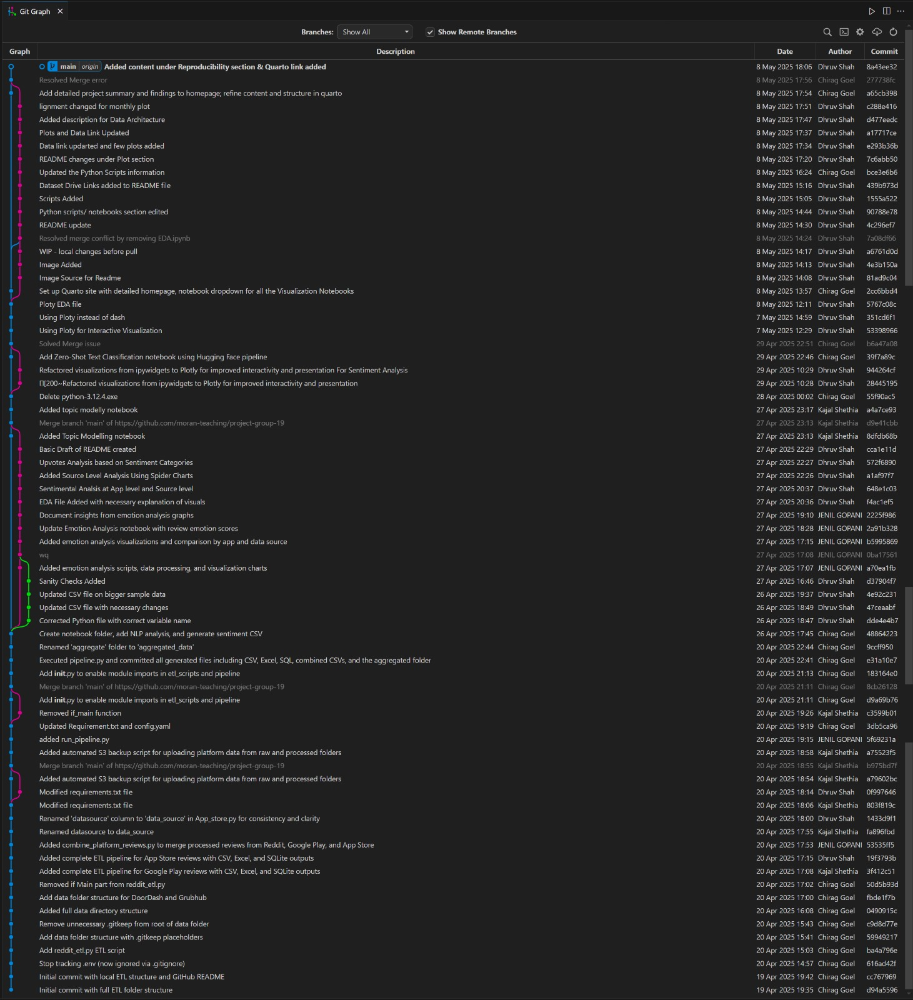

# MSDS-597 Project

Group: Project-Group-19

## Project summary

Our project summary can be found:
- as a website:

https://moran-teaching.github.io/project-group-19/

## Accessing data

Our raw data can be downloaded here:

[[Link to Raw Data](https://drive.google.com/drive/folders/11Koqtf_hD30G_7U7SKrjb2kys9hU9P80?usp=sharing)]

Our processed data can be downloaded here:

[[Link to Processed Data](https://drive.google.com/drive/folders/11Koqtf_hD30G_7U7SKrjb2kys9hU9P80?usp=sharing)]

NOTE: do not include your data in your git repo - it will likely be too large and cause issues.

## Python scripts / notebooks

The following scripts/notebooks were used produce the summary:
### pipeline/: Orchestrates the ETL workflow by running scripts to extract reviews from APIs and process them sequentially.
- `pipeline/run_pipeline.py` Executes all ETL scripts in order (App Store, Google Play, Reddit) to extract reviews using APIs and generate processed datasets.

### etl_scripts/: Python scripts for extracting, transforming, and combining review data from various platforms
- `etl_scripts/app_store_etl.py`  Extracts reviews from App Store using its API and processes them into a structured dataset.
- `etl_scripts/google_play_etl.py` Extracts reviews from Google Play Store using its API and processes them into a structured dataset.
- `etl_scripts/reddit_etl.py` Extracts reviews from Reddit using Reddit's API (PRAW or Pushshift) and processes them into structured format.
- `etl_scripts/s3_backup.py` Uploads processed review datasets to AWS S3 using boto3 for backup and remote storage.
- `etl_scripts/combine_platform_reviews.py` Combines reviews fetched from different platforms (Reddit, Google Play, App Store) into a unified dataset for streamlined analysis and processing.

### notebooks/:  Contains all the Jupyter notebooks related to data analysis, EDA, modeling, and classification
- `notebooks/EDA.ipynb` Performs exploratory data analysis and visualizations on review data using Plotly and ipywidgets.
- `notebooks/Emotion_Analysis.ipynb`Analyzes emotions in review texts using transformer models and NLP
- `notebooks/Sentiment_Analysis.ipynb`Performs sentiment analysis and interactive visualizations across data sources.
- `notebooks/Topic Modeling.ipynb` Extracts and visualizes main themes from reviews using topic modeling techniques.
- `notebooks/Zero_Shot_Classification.ipynb` Classifies reviews into categories using zero-shot classification with Hugging Face models.

[Give a short description of what the notebooks contain, and their location in the git repo]

## Reproducibility

Provide a `requirements.txt` file with packages and versions of all python packages to run the analysis.

🚀 Step-by-Step Procedure
1️⃣ Identify the App Name and Details
Decide on the new app you want to collect reviews for.

Gather the exact app name and details as used on:

Google Play → app name or package name (use Google Play Developer Console or URL).

App Store (iOS) → app name or App Store ID.

Reddit → app-related keywords or subreddit(s) related to the app.

2️⃣ Update ETL Scripts (In etl_scripts/)
➡️ Google Play Reviews
Open google_play_etl.py.

Change the app/package name where reviews are fetched.

Use libraries like google-play-scraper or adjust API endpoints accordingly.

➡️ App Store Reviews
Open app_store_etl.py.

Change the app ID or app name in the scraping logic.

Ensure the region and review parameters suit your needs.

➡️ Reddit Reviews
Open reddit_etl.py.

Change the search keywords or subreddit to reflect your new app.

Update filters if necessary to collect relevant posts/comments.

3️⃣ Update combined_platform_review.py
Make sure this script still correctly merges the datasets for the new app.

Update any hardcoded app names if required.

4️⃣ Re-run the ETL Pipeline
Run the ETL scripts to extract and combine reviews from all platforms.

Ensure CSVs are generated and combined properly.

bash
Copy
Edit
python etl_scripts/google_play_etl.py
python etl_scripts/app_store_etl.py
python etl_scripts/reddit_etl.py
python etl_scripts/combined_platform_review.py
5️⃣ Update Notebooks (If required)
Go to notebooks/ and change the app names wherever used.

This is to make the plots and analysis relevant to your new app (visualizations, sentiment analysis, topic modeling, etc.)

6️⃣ Run Analysis Pipelines
Execute the analysis notebooks to generate plots and insights.

You can also modify them to suit the new app’s context (optional).

7️⃣ Export and Visualize
Review the generated plots.

You can export plots and summaries for presentation or reporting.

8️⃣ (Optional) Backup on S3
The existing pipeline supports backup. Change the folder names in S3 bucket upload scripts if you wish to backup new app reviews.

## Guide

### Summary

Your summary should include the following. 

Note: You do not need code in your summary - instead, reference where in your github repo the code is. The priority should be a concise, readable summary. You should include visualizations and conclusions regarding your data analysis.

# 1. Data Collection and Sources
The data for this project was extracted from three major digital platforms: Reddit, Google Play Store, and Apple App Store.
We focused specifically on gathering user reviews related to three food delivery brands: Uber Eats, DoorDash, and GrubHub.
The collected data includes:
Review text (user's feedback)
Rating scores (for App Store and Play Store)
Number of upvotes (for Reddit)
Timestamps (date and time of the review)
Source platform (Reddit, Play Store, App Store)
App name (UberEats, DoorDash, GrubHub)

The extracted reviews were organized and stored in CSV file format, where each row represents one user review with associated metadata.
Data was collected as a one-time extraction for this project and is not automatically updated on a regular basis. However, the framework allows future re-scraping to keep the dataset updated if needed.

# 2. Data Sources, Retrieval, and Structure
We retrieved the data primarily using official APIs and custom scraping tools for each platform:
Google Play Store: Data was collected through the Play Store API, using Python-based scraping tools to extract app reviews, ratings, and timestamps.
Apple App Store: Reviews were accessed using the App Store Scraper API, which allowed us to gather user feedback, rating information, and timestamps for the specified apps.
Reddit: We used the Pushshift API to collect relevant posts and comments mentioning Uber Eats, DoorDash, and GrubHub. Additional metadata like upvotes, timestamps, and subreddit names were captured during the scraping process.
All retrieval processes required setting up API keys, handling pagination, and implementing rate limits where necessary to avoid service disruptions. The extracted raw data was then exported into CSV files for further cleaning and analysis.

# 3. Data Cleaning and Transformation
After extracting the raw data from various platforms, we performed a structured **ETL (Extract, Transform, Load)** process to transform the reviews into a clean, tidy tabular format suitable for analysis.
The main data cleaning and transformation steps included:
- **Text Normalization**:
  - Converted all text to lowercase.
  - Standardized brand mentions (e.g., "Uber Eats" → "ubereats", "Door Dash" → "doordash").
  - Removed special characters, emojis, URLs, and extra whitespace.
- **Handling Missing Values**:
  - Dropped reviews with missing critical fields (e.g., missing review text, missing timestamps).
  - Imputed or discarded incomplete metadata where necessary.
- **Data Structuring**:
  - Organized the reviews into structured **CSV files** with columns such as:
    - Review Text
    - Rating (for App Store and Play Store)
    - Upvotes (for Reddit)
    - Timestamp (datetime format)
    - Data Source (App Store / Play Store / Reddit)
    - App Name (UberEats, DoorDash, GrubHub)
- **Feature Engineering**:
  - Created new fields such as:
    - `cleaned_review`: preprocessed review text ready for NLP tasks
    - `sentiment`: sentiment classification (positive/neutral/negative)
    - `emotion_label`: emotion categorization (optional)
  - **Consistency Checks**:
  - Verified that timestamps were properly parsed into datetime formats.
  - Standardized column names across datasets to enable unified analysis later.

By following these steps, we ensured that the final datasets were **clean, consistent, complete**, and **ready for downstream analysis and visualization**.

# 4. Sanity Checks and Validation
After cleaning and structuring the raw data, we performed several validation steps to ensure the quality and integrity of the final datasets:
- **Missing Values Check**:
  - Verified that critical fields like `review_text`, `timestamp`, and `data_source` had no missing values.
  - Dropped rows where essential columns were null or incomplete.
- **Row Count Consistency**:
  - Cross-checked the number of extracted reviews against expected counts during scraping to ensure no major data loss occurred during ETL.
  - Confirmed that the number of rows remained reasonable after cleaning (no unexpected row drops).
- **Date Parsing Verification**:
  - Ensured that all timestamps were successfully parsed into valid `datetime` objects without errors.
- **Duplicate Detection**:
  - Checked and removed duplicate review entries based on review text and timestamp combinations.
- **Column Type Enforcement**:
  - Verified that fields like `rating`, `upvotes`, and `sentiment` were of appropriate data types (integer, string, datetime).

While we did not use a formal `pytest` framework, we incorporated **assertion-based checks** inside our ETL scripts to automatically catch and flag data issues during preprocessing.

These validations helped ensure that the data was **accurate**, **consistent**, and **ready for robust analysis and modeling**.explain any tests you did to check data (e.g. using `pytest` to verify that no missing values are present in the tidied dataframes, verify that the resulting number of rows is reasonable)

# 5. Data Enrichment
Beyond cleaning the raw reviews, we performed several **data enrichment** steps to add additional features and context to the dataset:
- **Sentiment Labeling**:
  - Used Natural Language Processing (NLP) models to assign a **sentiment** label (**positive**, **neutral**, or **negative**) to each review based on the text content.
  - This allowed us to categorize user opinions automatically without manual labeling.
- **Timestamp Normalization**:
  - Converted all timestamps into a **uniform datetime format** across platforms, making it easier to perform time-based analyses and monthly trend plots.

These enrichment steps enhanced the original datasets, making them **more informative**, **machine-readable**, and **ready for deeper sentiment, emotion, and trend analysis** across multiple dimensions.

# 6. Summary Statistics

After cleaning and enriching the dataset, we calculated several **summary statistics** to better understand the overall trends and patterns in user reviews across platforms and apps.

Key summary statistics include:
- **Total Number of Reviews**:
  - The total count of reviews collected for each app (**UberEats**, **DoorDash**, **GrubHub**) from each data source (**App Store**, **Google Play**, **Reddit**).
- **Sentiment Distribution**:
  - Percentage breakdown of **positive**, **neutral**, and **negative** reviews by platform and by app.
  - This highlighted which platforms/apps had more positive feedback and where dissatisfaction was higher.
- **Ratings Distribution (where available)**:
  - Calculated the mean, median, and mode of star ratings from App Store and Play Store data.
  - This helped confirm if textual sentiments aligned with numerical ratings.

- **Upvotes Analysis (Reddit only)**:
  - Analyzed the average and maximum number of upvotes for Reddit posts mentioning the food delivery apps, giving an idea of which complaints or praises resonated most with users.

- **Monthly Trends**:
  - Summarized the number of reviews per month, showing how review volume changed over time (e.g., seasonal trends, spikes around holidays, service promotions).
These descriptive statistics laid the groundwork for more advanced analyses such as sentiment modeling, clustering, and topic extraction.  
They provided an initial **high-level view** of customer feedback patterns across multiple platforms.

7. present around 4-6 visualizations related to the data, explain trends and conclusions

You should have at least one interactive data widget.

### 📌 Data Architecture

**Description:**  
This diagram explains the entire data pipeline workflow. The process starts with extracting raw data from various APIs, namely Reddit, Playstore, and Appstore. Once collected, the data undergoes a series of transformation steps to clean, structure, and make it analysis-ready. The transformed data is then securely loaded and backed up into multiple formats (CSV, XLSX, SQL) as well as pushed to Amazon S3 for long-term storage and recovery.

The processed datasets are subsequently fed into various analytical modules — including Sentiment Analysis to capture user sentiment, Emotion Analysis to detect underlying emotions, Topic Modelling to identify common discussion topics, and Zero Shot Classification for flexible categorization of reviews without manual labeling.

Finally, the results from these models are aggregated and visualized to enable data-driven decision making and insights generation for stakeholders.

---

### 📈 Monthly Review Counts per App

**Description:**  
The line graph shows review counts varied month-over-month. UberEats and Doordash show seasonal trends, Grubhub is more stable.

### 📌 Sentiment Distribution per App

**Description:**  
These donut charts show sentiment distribution (Positive, Neutral, Negative) for UberEats, DoorDash, and GrubHub. UberEats shows the highest negative sentiment, followed by DoorDash and GrubHub.

---

### 📌 Emotion Analysis

**Description:**  
This bar chart highlights the average emotion scores detected across reviews. "Disappointment" emerged as the most frequent emotion followed by excitement and relief, reflecting customer dissatisfaction prominently.

---

### 📌 Topic Modeling

**Description:**  
The bar plot shows the top 30 terms contributing to one of the extracted topics from customer reviews. These terms help us understand recurring issues like order, service, and refund.

---

### 📌 Topic Modeling Clusters

**Description:**  
This bubble chart visualizes topic modeling clusters, where each circle represents a distinct topic extracted from user reviews, positioned by semantic similarity and sized by topic prevalence.

---

### 📌 Negative Word Cloud (App Wise)

**Description:**  
The word clouds visualize the most frequent negative terms mentioned by users for each app — UberEats, DoorDash, and GrubHub. Prominent words like "order", "service", and "delivery" point to key pain points.

---
### 📌 Zero Shot Classification

**Description:**  
This plot shows the classification of reviews into complaint categories without explicit labels using Zero-Shot learning. "Unresponsive Customer Service" and "Overpriced" were among the most detected issues.

---

You can include figures for example from an external notebook:
- https://quarto.org/docs/blog/posts/2023-03-17-jupyter-cell-embedding/ 
- https://quarto.org/docs/authoring/includes.html

8. at the end, display a graph of the git commit history

For team members of 2: 10 commits. Of 3: 15 commits. Of 4: 20 commits.

Your commits history elsewhere may be more dirty, but these 10-20 commits need to be clean and can be drawn as a graph.

Make sure your git graphs include author names, commit messages, date, git tags if any.

You can generate nice graphs of git commits with many tools. Among others, you could generate git-graphs using the following tools:

- in vscode: https://marketplace.visualstudio.com/items?itemName=mhutchie.git-graph
- https://stackoverflow.com/questions/1057564/pretty-git-branch-graphs
- https://www.gitkraken.com/solutions/commit-graph

---

### Data storage options

Some options for data storage:

- Box link (free with Rutgers account)
- Dropbox
- Google Drive

The following companies have free data storage (up to ~5 GB) for 12 months. Be careful to make sure you're within the free limits!!!

- AWS S3 https://aws.amazon.com/s3/
- Google Cloud https://cloud.google.com/free
- Microsoft Azure https://azure.microsoft.com/en-us/free/students

